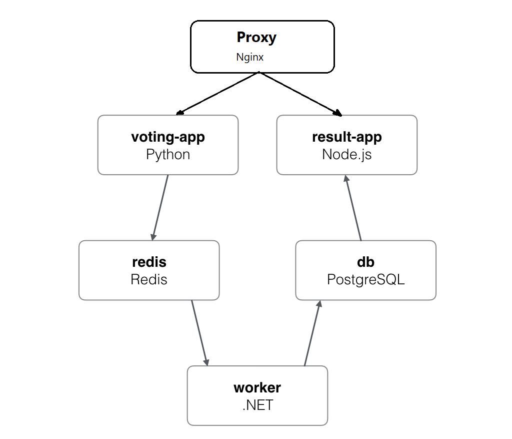

Example Voting App
=========

Credit: this repo is forked from https://github.com/dockersamples/example-voting-app, modified to run on Azure App Servcie with Multi-container support. 

Getting started
---------------
Download [Docker](https://www.docker.com/products/overview). If you are on Mac or Windows, [Docker Compose](https://docs.docker.com/compose) will be automatically installed. On Linux, make sure you have the latest version of [Compose](https://docs.docker.com/compose/install/). If you're using [Docker for Windows](https://docs.docker.com/docker-for-windows/) on Windows 10 pro or later, you must also [switch to Linux containers](https://docs.docker.com/docker-for-windows/#switch-between-windows-and-linux-containers).

Run in this directory:
```
docker-compose up
```
The app will be running at [http://localhost:80](http://localhost:80), and the results will be at [http://localhost/result](http://localhost/result).

Run the app in Azure App Service
--------------------------------

Make sure you have the latest Azure CLI installed. Follow the steps in this [tutorial]https://docs.microsoft.com/en-us/azure/app-service/containers/tutorial-custom-docker-image) to create Azure Resource Group and Linux App Service plan, please ignore the stpes for downloading the sample repo. We should be able to provide a tutorial specifically for Multi-container Web App, stay tunned. 

Once you have a Linux App Service plan, you can run the following CLI to create a Web App for this voting sample: 
$ az webapp create --resource-group [resource group] --plan [service plan] --name [app name] --multicontainer-config-type "compose" --multicontainer-config-file "docker-compose-appservice.yml"

Wait for about a minute, you can then access the voting app at: [https://appname.azurewebsites.net/](https://appname.azurewebsites.net/), and the the results will be at [https://appname.azurewebsites.net/result](https://appname.azurewebsites.net/result). Enjoy!


Rune the app in Docker Swarm
----------------------------

Alternately, if you want to run it on a [Docker Swarm](https://docs.docker.com/engine/swarm/), first make sure you have a swarm. If you don't, run:
```
docker swarm init
```
Once you have your swarm, in this directory run:
```
docker stack deploy --compose-file docker-stack.yml vote
```

Run the app in Kubernetes
-------------------------

The folder k8s-specifications contains the yaml specifications of the Voting App's services.

Run the following command to create the deployments and services objects:
```
$ kubectl create -f k8s-specifications/
deployment "db" created
service "db" created
deployment "redis" created
service "redis" created
deployment "result" created
service "result" created
deployment "vote" created
service "vote" created
deployment "worker" created
```

The vote interface is then available on port 31000 on each host of the cluster, the result one is available on port 31001.

Architecture
-----



* A Nginx proxy which handles the inbound requests for voting and result pages
* A Python webapp which lets you vote between two options
* A Redis queue which collects new votes
* A .NET worker which consumes votes and stores them in…
* A Postgres database backed by a Docker volume
* A Node.js webapp which shows the results of the voting in real time


Note
----

iThe voting application only accepts one vote per client. It does not register votes if a vote has already been submitted from a client. Voter can change the vote at any time and result will be reflected on results page.
